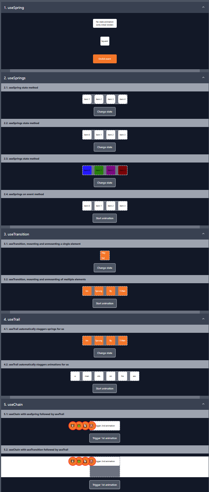

# About

Various scenarios for using the [react-spring](https://www.react-spring.dev/docs) library.

This repository is based on [im-sprung-react-spring-tutorial](https://github.com/kevinqtogitty/Im-SPRUNG-react-spring-tutorial)
repository with layout changes and minor bug fixes.

